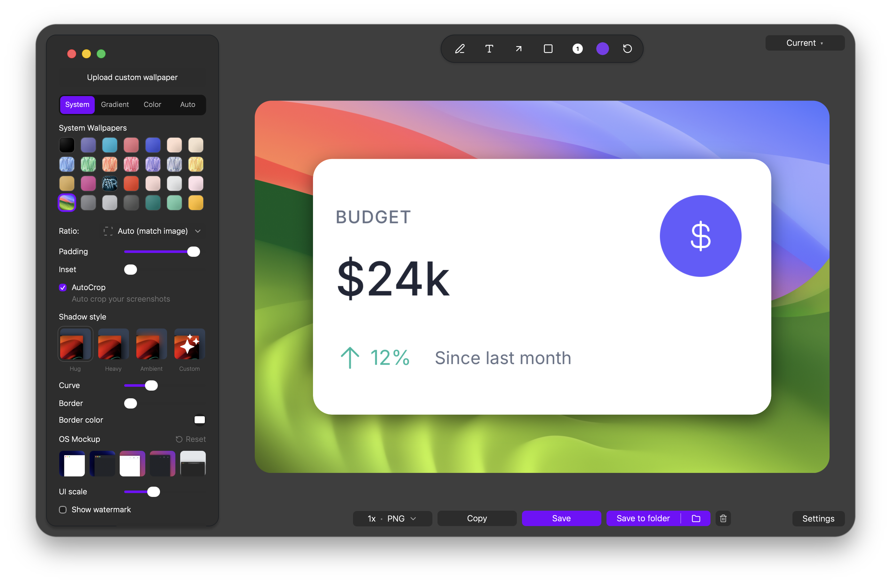
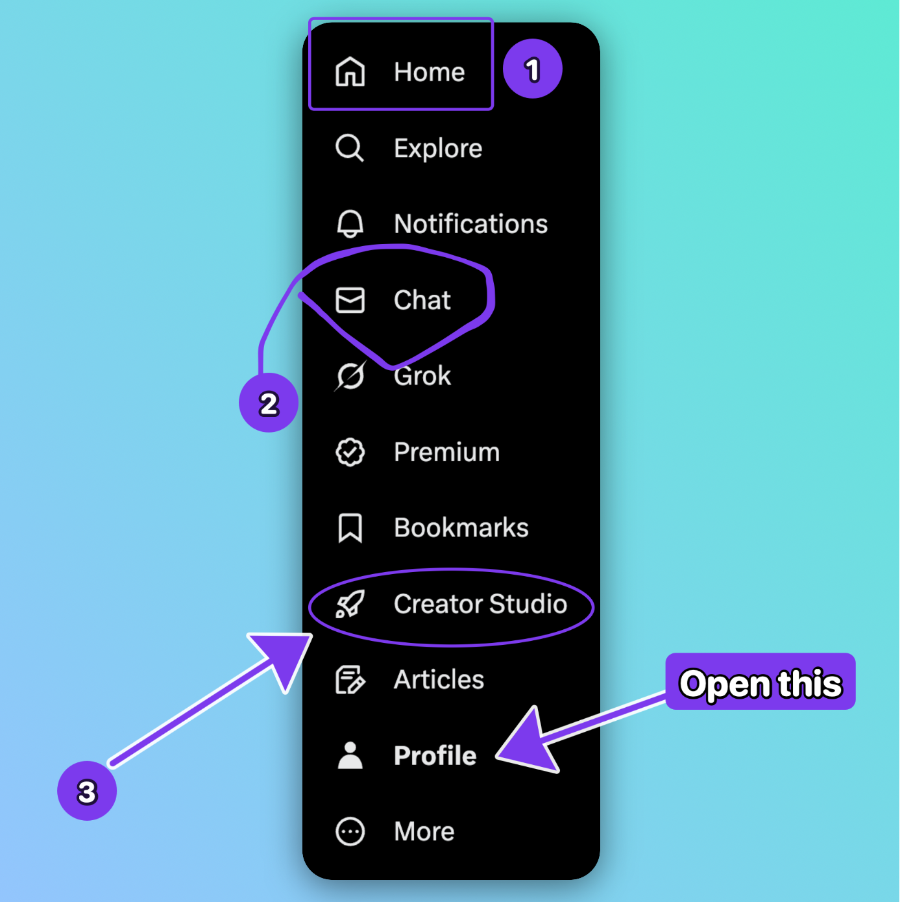
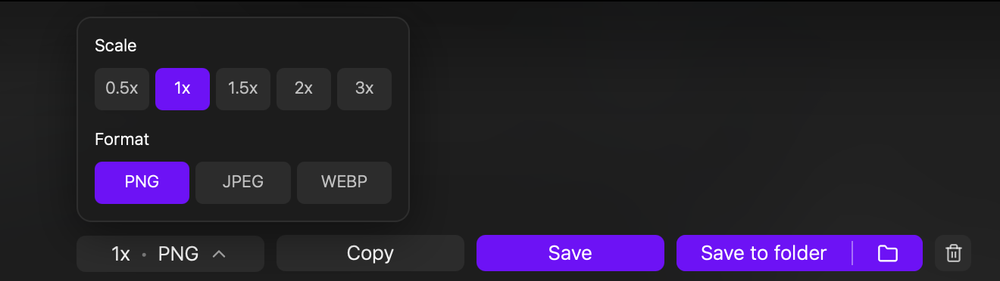
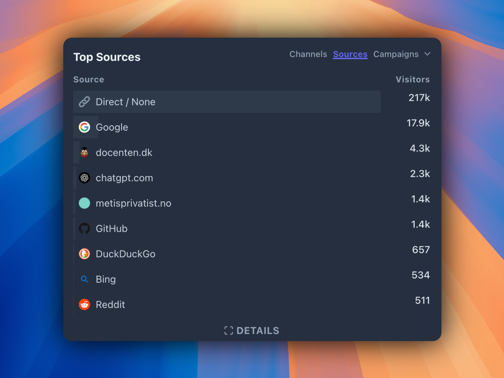

# SiteShot

<p align="center">
	
</p>

<p align="center">
	
	
</p>

### Create polished, presentation-ready screenshots instantly.
[SiteShot](https://github.com/webadderall/shot) is an open-source desktop app for capturing, styling, annotating, and exporting screenshots with gradients, wallpapers, blob backgrounds, shadows, mockups, rounded corners, watermark controls, and desktop-native save or copy flows.
> [!NOTE]
> This is just a side project I made to solve my own problem that I'm open-sourcing now.

<p align="center">
	
</p>

---

## What is SiteShot?

SiteShot is a desktop-first screenshot capture and styling tool. Instead of taking a screenshot and finishing the presentation work in multiple other apps, SiteShot keeps the common workflow in one place: capture the image, add framing and polish, annotate it, and export a clean final asset.

SiteShot targets:

- **macOS**
- **Windows**

Platform notes:

- **macOS** supports desktop-native screenshot and export workflows through the Tauri shell and native helpers.
- **Windows** uses the same desktop UI with platform-specific native integration through Tauri.

---

# Core Features

## Capture, frame, and polish screenshots in one workflow
SiteShot can capture screenshots directly in the desktop app, then place them inside gradients, wallpapers, colors, blob backgrounds, browser bars, OS mockups, padding, rounded corners, and shadow treatments without leaving the editor.

<p>
	
</p>

## Annotate and refine presentation details
Add pen and shape annotations, tune inset and border styling, rotate and position the screenshot, adjust background effects, and optionally apply watermark text or badges for quick sharing workflows.

<p>
	
</p>

## Export to file, folder, or clipboard
The app supports desktop-native export flows for saving directly, saving into a chosen folder, or copying the final rendered image to the clipboard with the same styling pipeline used in preview.

<p>
	
</p>

## Example output
This is the kind of final asset the app is meant to produce after framing, styling, and export.

<p>
	
</p>

## All Features

### Capture

- Capture screenshots from the desktop app
- Insert captured screenshots directly into the editor
- Reuse captured images without switching tools
- Support screenshot-focused desktop workflows instead of browser-only upload flows

### Editing and Presentation

- Background gradients
- Blob gradient backgrounds
- Solid color backgrounds
- System wallpaper selection
- Custom uploaded wallpapers
- Browser bar and OS mockup framing
- Padding and inset controls
- Rounded corners and border controls
- Shadow presets and custom shadow tuning
- Rotation and transform positioning
- Aspect ratio presets
- Auto-crop option

### Annotations and Branding

- Pen annotations
- Shape annotations
- Watermark text
- Watermark position and offset controls
- Optional social-style watermark prefix and badge toggles

### Export

- Save image through desktop-native dialogs
- Save image directly into a selected folder
- Copy final image to clipboard
- PNG, JPEG, and WebP export options
- Export scaling and quality controls
- Export pipeline tuned for desktop-safe local assets and canvases

### Workflow and Usability

- Custom keyboard shortcuts
- Settings modal for desktop behavior and shortcut preferences
- Close-after-copy/save/save-to-folder options
- Shared rendering pipeline between preview and export
- Desktop-first Tauri shell with native file and screenshot integration

---

# Installation

## Download a build

Prebuilt desktop releases should be published on the repository Releases page.

GitHub Actions release workflows can build macOS and Windows installers from a tagged release or a manual dispatch.

---

## Landing Page And GitHub Pages

The repository ships a static landing page bundle in `landing/`.

- `landing/index.html` is the exported homepage entrypoint.
- `landing/js/` contains the exported Framer runtime assets used by the page.
- `.github/workflows/pages.yml` deploys the `landing/` folder to GitHub Pages on pushes to `main`, `master`, or `app-dev`.

To enable deployment in GitHub:

1. Open repository **Settings > Pages**.
2. Set the source to **GitHub Actions**.
3. Push to one of the configured branches or run the **Deploy Landing Page** workflow manually.

The workflow publishes the static landing page directly from `landing/`, so it stays separate from the Tauri app build.

---

## Build from source

```bash
git clone <your-repo-url> siteshot
cd siteshot
npm install
npm run tauri:dev
```

For a production web bundle used by the desktop app:

```bash
npm run build
```

For a packaged desktop build:

```bash
npm run tauri:build
```

---

## macOS: "App cannot be opened"

Locally built desktop apps may be quarantined by macOS.

Remove the quarantine flag with:

```bash
xattr -rd com.apple.quarantine /Applications/SiteShot.app
```

---

# System Requirements

| Platform | Minimum version | Notes |
| --- | --- | --- |
| **macOS** | Recent supported macOS release | Native screenshot permissions must be granted for capture workflows. |
| **Windows** | Recent supported Windows release | Native dialogs and screenshot behavior depend on desktop permissions and OS policy. |

> [!IMPORTANT]
> Desktop screenshot capture and export depend on OS permissions, local filesystem access, and Tauri-native integrations. Test the full capture and export flow on both shipping targets before calling a release stable.

---

# Usage

## Capture

1. Launch SiteShot.
2. Capture a screenshot or upload an image.
3. Wait for the image to open in the editor.

## Edit

Inside the editor you can:

- choose gradients, wallpapers, colors, or blob backgrounds
- add padding, inset, rounded corners, borders, and shadows
- use browser bars or mockups for presentation framing
- annotate the screenshot with pen or shape tools
- add watermark text and tweak export styling

## Export

Export options include:

- **Save** through the desktop file dialog
- **Save to folder** for a repeatable output folder workflow
- **Copy output** for clipboard-based sharing

You can adjust output format, export quality, and scale before export.

---

# Limitations

### Screenshot permissions

Desktop capture depends on OS-level permissions. If capture is unavailable, verify that the app has the required screen recording or screenshot permissions.

### Export correctness with local assets

SiteShot supports local wallpapers and native asset URLs, but desktop export pipelines still need extra normalization work for some WebView environments. This is handled in-app, though very large local assets may make export slightly slower.

### Platform differences

Clipboard behavior, save dialogs, and native screenshot helpers differ between macOS and Windows. Validate both independently before treating them as equivalent.

---

# How It Works

SiteShot combines a desktop shell, a shared renderer, and a native-backed export pipeline.

**Desktop shell**
- Tauri provides the desktop app runtime, window management, dialogs, and native command bridge.

**UI**
- The active frontend lives in `ui/` and is built with React.

**Rendering**
- Shared editor and rendering logic lives in `components/` and `utils/`.
- Preview and export intentionally share the same styling decisions so exported output matches what users see.

**Native integration**
- Rust commands in `src-tauri/` handle desktop-native file, screenshot, and image operations.

**Export**
- The export pipeline normalizes image sources, handles canvas-backed rendering, and produces PNG, JPEG, or WebP output for save and clipboard flows.

---

# Contribution

Contributions are accepted.

Please keep pull requests focused, validate capture/edit/export flows, and avoid unrelated refactors.

See `CONTRIBUTING.md` for guidelines.

---

# Community

Bug reports and feature requests belong in the repository issue tracker.

Pull requests are welcome.

---

# License

SiteShot is licensed under the **MIT License**.

---

# Credits

Created by webadderall

---

